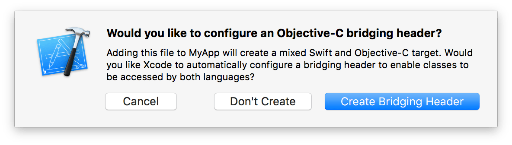

# 在同一工程中使用 Swift 和 Objective-C

本页包含内容：

- [混合搭配概述](#mix_and_match_overview)
- [在 App 的 target 内部导入代码](#importing_code_from_within_the_same_app_target)
- [在 Framework 的 target 内部导入代码](#importing_code_from_within_the_same_framework_target)
- [导入外部 Framework](#importing_external_frameworks)
- [在 Objective-C 中使用 Swift](#using_swift_from_objective-c)
- [为 Objective-C 接口重写 Swift 符号名](#overriding_swift_names_for_Objective-C_interfaces)
- [令 Objective-C 接口在 Swift 中不可用](#Making Objective-C Interfaces Unavailable in Swift)
- [精炼 Objective-C 声明](#Refining Objective-C Declarations)
- [命名产品模块](#naming_your_product_module)
- [故障排除贴士](#troubleshooting_tips_and_reminders)

由于 Swift 与 Objective-C 的兼容性，可以在同一工程中同时使用两种语言，开发基于混合语言的应用。利用这种特性，可以用 Swift 的最新语言特性实现应用的部分功能，并无缝并入现有的 Objective-C 代码中。

<a name="mix_and_match_overview"></a>
## 混合搭配概述

Objective-C 和 Swift 文件可以在同一工程中并存，无论这个工程原本是基于 Objective-C 还是 Swift。还可以直接往现有工程中添加另一种语言的源文件。这种自然的工作流使得创建混合语言的应用程序或框架和单独使用一种语言时一样简单。

取决于是在写应用程序还是在写框架，基于混合语言编写时，二者稍微有些区别。下面描述了使用两种语言时，在同一 target 中导入模型的一般情况，后续小节会有更多细节。


<a name="importing_code_from_within_the_same_app_target"></a>
## 在同一应用的 target 中导入代码（Importing Code from Within the Same App Target）

如果你在写混合语言的应用，可能需要用 Swift 代码访问 Objective-C 代码，或者反之。下面描述的流程适用于非框架的 target 。

### 将 Objective-C 导入 Swift（Importing Objective-C into Swift）

在同一应用的 target 中导入一系列 Objective-C 文件供 Swift 代码使用时，你需要依靠 Objective-C 桥接头文件（*Objective-C bridging header*）暴露这些文件给 Swift。当你添加 Swift 文件到现有的 Objective-C 应用（或反之）时，Xcode 会自动创建这些头文件。



如果你同意，Xcode 会随着源文件的创建生成头文件，并用产品模块名加上`-Bridging-Header.h`命名。关于产品模块名，详见 [命名你的产品模块（Naming Your Product Module）](#naming_your_product_module)。

或者，你可以选择`File > New > File > (iOS or OS X) > Source > Header File`手动创建桥接头文件。

你可以编辑这个头文件来对 Swift 暴露出 Objective-C 代码。

##### 在同一 target 中将 Objective-C 代码导入到 Swift 中

1. 在 Objective-C 桥接头文件中，导入任何你想暴露给 Swift 的头文件，例如：

    ```objective-c
    #import "XYZCustomCell.h"
    #import "XYZCustomView.h"
    #import "XYZCustomViewController.h"
    ```

2. 确保在`Build Settings > Swfit Compiler - Code Generation > Objective-C Bridging Header`中设置了 Objective-C 桥接头文件相对工程的路径，而不是它所在的目录。

路径形式类似`Info.plist`在`Build Settings`中指定的路径。在大多数情况下，你不需要修改这个默认设置。

在这个桥接头文件中列出的所有 public 的 Objective-C 头文件都会对 Swift 可见。之后当前 target 的所有 Swift 文件都可以使用这些头文件中的方法，不需要任何 import 语句。而且你能用 Swift 语法使用这些 Objective-C 代码，就像使用系统自带的 Swift 类一样。

```swift
let myCell = XYZCustomCell()
myCell.subtitle = "A custom cell"
```

### 将 Swift 导入 Objective-C（Importing Swift into Objective-C）

当你将 Swift 代码导入到 Objective-C 中时，你依靠 Xcode 生成的头文件来将这些文件暴漏给 Objective-C。这个自动生成的文件是一个声明了 target 中的 Swift 接口的 Objective-C 头文件。可以把这个 Objective-C 头文件看作 Swift 代码的 `umbrella header`。头文件名称以产品模块名加`-Swift.h`来命名。（关于产品模块名，详见 [命名你的产品模块（Naming Your Product Module）](#naming_your_product_module)。）

默认情况下，生成的头文件包含标记有`public`修饰符的 Swift 声明。如果你的应用程序的 target 有一个 Objective-C 的桥接头文件的话，它还包含那些标记有`internal`修饰符的声明。标有`private`修饰符的声明不会出现在所生成的头文件。私有声明不会暴露给 Objective-C，除非它们被明确标有`@IBAction`，`@IBOutlet`，或`@objc`。如果你的应用程序的 target 启用了单元测试，单元测试的 target 可以访问任何标有`internal`修饰符的声明，只需在导入产品模块时标记`@testable`属性。

关于访问级别的更多信息，参看[《The Swift Programming Language 中文版》](http://wiki.jikexueyuan.com/project/swift/)中的 [访问控制（Access Control）](http://wiki.jikexueyuan.com/project/swift/chapter2/24_Access_Control.html)。

你不需要做任何特别的事情来生成这个头文件，只需要将它导入到你的 Objective-C 代码来使用它。注意这个头文件中的 Swift 接口包含了它所使用到的所有 Objective-C 类型。如果你在 Swift 代码中使用你自己的 Objective-C 类型，确保先将对应的 Objective-C 头文件导入到你的 Swift 代码中，然后才将 Swift 自动生成的头文件导入到 Objective-C `.m`文件中来访问 Swift 代码。

##### 在同一 target 中将 Swift 代码导入到 Objective-C 中

- 在同一 target 的 Objective-C `.m`文件中，用下面的语法来导入 Swift 代码：

```objective-c
#import "ProductModuleName-Swift.h"
```

target 中的 Swift 文件将会对包含这个导入语句的 Objective-C `.m`文件可见。关于在 Objective-C 代码中使用 Swift 代码，详见 [在 Objective-C 中使用 Swift（Using Swift from Objective-C）](#using_swift_from_objective-c)。

|              | 导入到 Swift | 导入到 Objective-C  |
| :-------------:|:-----------:|:------------:|
| Swift 代码    | 不需要导入语句  | #import "ProductModuleName-Swift.h”  |
| Objective-C 代码     | 不需要导入语句；需要 Objective-C 桥接头文件| #import "Header.h"     |


<a name="importing_code_from_within_the_same_framework_target"></a>
## 在同一 Framework 的 target 中导入代码（Importing Code from Within the Same Framework Target）

如果你在写一个混合语言的框架，可能会从 Swift 代码访问 Objective-C 代码，或者反之。

### 将 Objective-C 导入 Swift（Importing Objective-C into Swift）

要将一些 Objective-C 文件导入到同一框架 target 的 Swift 代码中去，你需要将这些文件导入到 Objective-C 的`umbrella header`来供框架使用。

##### 在同一 framework 中将 Objective-C 代码导入到 Swift 中

确保将框架 target 的`Build Settings > Packaging > Defines Module`设置为`Yes`。然后在你的`umbrella header`头文件中导入你想暴露给 Swift 访问的 Objective-C 头文件，例如：

```objective-c
#import <XYZ/XYZCustomCell.h>
#import <XYZ/XYZCustomView.h>
#import <XYZ/XYZCustomViewController.h>
```

Swift 将会看到所有你在`umbrella header`中公开暴露出来的头文件，框架 target 中的所有 Swift 文件都可以访问你的 Objective-C 文件的内容，不需要任何导入语句。同时你可以用 Swift 语法使用你自定义的 Objective-C 代码。

```swift
let myOtherCell = XYZCustomCell()
myOtherCell.subtitle = "Another custom cell"
```

### 将 Swift 导入 Objective-C（Importing Swift into Objective-C）

要将一些 Swift 文件导入到同一框架的 target 的 Objective-C 代码中，你不需要导入任何东西到`umbrella header`文件，而是将 Xcode 为你的 Swift 代码自动生成的头文件导入到要访问 Swift 代码的 Objective-C `.m`文件。

由于为框架的 target 生成的头文件是框架的 public 接口部分，因此只有标记`public`修饰符的声明才会出现在生成的头文件中。在框架内部的 Objective-C 部分，你可以使用标记`internal`的 Swift 方法和属性，只要它们声明在继承自 Objective-C 的类中。

##### 在同一 framework 中将 Swift 代码导入到 Objective-C 中

确保将框架 target 的`Build Settings > Packaging > Defines Module`设置为`Yes`。用下面的语法将 Swift 代码导入到同一框架 target 下的 Objective-C `.m`文件。

```objective-c
#import <ProductName/ProductModuleName-Swift.h>
```

框架 target 下的 Swift 文件都会对包含这个导入语句的 Objective-C `.m`文件可见。关于在 Objective-C 代码中使用 Swift 代码，详见 [在 Objective-C 中使用 Swift（Using Swift from Objective-C）](#using_swift_from_objective-c)。

|              | 导入到 Swift | 导入到 Objective-C  |
| :-------------:|:-----------:|:------------:| 
| Swift 代码    | 不需要导入语句  | #import "ProductName/ProductModuleName-Swift.h"  |
| Objective-C 代码     | 不需要导入语句；需要 Objective-C umbrella header  | #import "Header.h"     |


<a name="importing_external_frameworks"></a>
## 导入外部 Framework（Importing External Frameworks）

你可以导入外部框架，无论这个框架是基于纯 Objective-C，纯 Swift，还是混合语言的，而且导入流程都是一样的。当你导入外部框架时，确保`Build Setting > Pakaging > Defines Module`设置为`Yes`。

用下面的语法将框架导入到不同 target 的 Swift 文件中：

```swift
import FrameworkName
```

用下面的语法将框架导入到不同 target 的 Objective-C `.m`文件中：

```objective-c
@import FrameworkName;
```


|           | 导入到 Swift | 导入到 Objective-C  |
| :-------------:|:-----------:|:------------:| 
|任意语言框架 | import FrameworkName | @import FrameworkName; |

<a name="using_swift_from_objective-c"></a>
## 在 Objective-C 中使用 Swift（Using Swift from Objective-C）

当你将 Swift 代码导入 Objective-C 之后，便可用常规的 Objective-C 语法来使用 Swift 类。

```objective-c
MySwiftClass *swiftObject = [[MySwiftClass alloc] init];
[swiftObject swiftMethod];
```

Swift 的类或协议必须用`@objc`属性来标记，以便在 Objective-C 中可访问。这个属性告诉编译器这块 Swift 代码可以从 Objective-C 代码中访问。如果你的 Swift 类是 Objective-C 类的子类，编译器会自动为你添加`@objc`。详见 [Swift 类型兼容性（Swift Type Compatibility）](https://github.com/949478479/Using-Swift-with-Cocoa-and-Objective-C/blob/master/02Interoperability/01Interacting%20with%20Objective-C%20APIs.md#swift-%E7%B1%BB%E5%9E%8B%E5%85%BC%E5%AE%B9%E6%80%A7swift-type-compatibility)。

你可以访问在 Swift 类或协议中用`@objc`属性标记的任何东西，只要它与 Objective-C 兼容，但不包括以下 Swift 独有的特性：

-  范型（Generics）
-  元组（Tuples）
-  Swift 中定义的原始值类型不是`Int`的枚举（Enumerations defined in Swift without Int raw value type）
-  Swift 中定义的结构体（Structures defined in Swift）   
-  Swift 中定义的顶级函数（Top-level functions defined in Swift）
-  Swift 中定义的全局变量（Global variables defined in Swift）
-  Swift 中定义的类型别名（Typealiases defined in Swift）
-  Swift 风格的可变参数（Swift-style variadics）
-  嵌套类型（Nested types）
-  柯里化函数（Curried functions）

例如，使用范型类型作为参数，或者返回元组的方法将不能在 Objective-C 中使用。

> 注意

> 你不能在 Objective-C 继承一个 Swift 类。

### 在 Objective-C 头文件中引用 Swift 类或协议（Referencing a Swift Class or Protocol in an Objective-C Header）

为避免循环引用，不要导入 Swift 代码到 Objective-C 的头文件，而应该使用提前声明来引用一个 Swift 类或者协议。

```objective-c
// MyObjcClass.h
@class MySwiftClass;
@protocol MySwiftProtocol;
     
@interface MyObjcClass : NSObject
- (MySwiftClass *)returnSwiftClassInstance;
- (id <MySwiftProtocol>)returnInstanceAdoptingSwiftProtocol;
// ...
@end
```

Swift 类和协议的提前声明只能用于声明方法和属性。

### 在 Objective-C 实现中采用 Swift 协议（Adopting a Swift Protocol in an Objective-C Implementation）

Objective-C 类可以在实现文件中通过导入 Xcode 自动生成的头文件配合类扩展来采用 Swift 协议。

```objective-c
// MyObjcClass.m
#import "ProductModuleName-Swift.h"
     
@interface MyObjcClass () <MySwiftProtocol>
// ...
@end
     
@implementation MyObjcClass
// ...
@end
```

<a name="overriding_swift_names_for_Objective-C_interfaces"></a>
## 为 Objective-C 接口重写 Swift 名称（Overriding Swift Names for Objective-C Interfaces）

Swift 编译器自动将 Objective-C 代码作为常规 Swift 代码导入。它将 Objective-C 类的工厂方法作为 Swift 构造器导入，以及缩短 Objective-C 的枚举类型名称。

在你的代码中也许存在不能够被自动处理的边界情况。如果你需要更改导入到 Swift 中的 Objective-C 方法名，枚举值的名字，或者可选集的值的名字，你可以使用`NS_SWIFT_NAME`宏来自定义导入的声明。

### 类工厂方法（Class Factory Methods）

如果 Swift 编译器无法识别类工厂方法，你可以使用`NS_SWIFT_NAME`宏来传递构造器的 Swift 签名，从而正确导入。例如：

```objective-c
+ (instancetype)recordWithRPM:(NSUInteger)RPM NS_SWIFT_NAME(init(RPM:));
```

如果 Swift 编译器错误地将一个方法识别为类工厂方法，你可以使用`NS_SWIFT_NAME`宏来传递类方法的 Swift 签名，从而正确导入。例如：

```objective-c
+ (id)recordWithQuality:(double)quality NS_SWIFT_NAME(record(quality:));
```

### 枚举（Enumerations）

默认情况下，Swift 将枚举值的名称前缀截断来导入枚举。如果要自定义枚举值的名称，你可以使用`NS_SWIFT_NAME`宏来传递 Swift 枚举值名称。例如：

```objective-c
typedef NS_ENUM(NSInteger, ABCRecordSide) {
    ABCRecordSideA,
    ABCRecordSideB NS_SWIFT_NAME("FlipSide"),
};
```

<a name="Making Objective-C Interfaces Unavailable in Swift"></a>
## 让 Objective-C 接口在 Swift 中不可用（Making Objective-C Interfaces Unavailable in Swift）

一些 Objective-C 接口可能不适合或者没必要暴露给 Swift 。为了防止 Objective-C 接口暴露给 Swift ，使用`NS_SWIFT_UNAVAILABLE`宏来指导 API 使用者使用其他替代方式。

例如，一个 Objective-C 类提供了一个接收一些键值对作为可变参数的便利构造器，可以建议 Swift 用户使用字典字面量作为替代：

```objective-c
+ (instancetype)collectionWithKeysAndValues:(id)firstKey, ... NS_SWIFT_UNAVAILABLE("Use a dictionary literal instead");
```

试图在 Swift 中调用`+collectionWithKeysAndValues:`方法将导致一个编译错误。

<a name="Refining Objective-C Declarations"></a>
## 精练 Objective-C 声明（Refining Objective-C Declarations）

你可以使用`NS_REFINED_FOR_SWIFT`宏标记 Objective-C 方法的声明，然后在 Swift 中通过扩展提供一个精练的 Swift 接口，并通过该接口去调用方法的原始实现。使用该宏后，方法名将遵循以下约定：

- 初始化方法导入到 Swift 后，在其第一个外部参数名前加双下划线。
- 对象下标方法导入到 Swift 后，如果存取方法中任意一个方法标记为`NS_REFINED_FOR_SWIFT`，在其方法名前加双下划线，而不是导入为 Swift 下标方法，。
- 其他方法导入到 Swift 后，在其方法名前加双下划线。

举例来说，接收一个或者多个指针参数的 Objective-C 方法可以精练为一个返回元组值的 Swift 方法。思考下面的 Objective-C 声明：

```objective-c
@interface Color : NSObject

- (void)getRed:(nullable CGFloat *)red
         green:(nullable CGFloat *)green
          blue:(nullable CGFloat *)blue
         alpha:(nullable CGFloat *)alpha NS_REFINED_FOR_SWIFT;
@end
```

你可以通过 Swift 扩展来提供一个更精练的接口：

```swift
extension Color {
    var RGBA: (red: CGFloat, green: CGFloat, blue: CGFloat, alpha: CGFloat) {
        var r: CGFloat = 0.0
        var g: CGFloat = 0.0
        var b: CGFloat = 0.0
        var a: CGFloat = 0.0
        __getRed(&r, green: &g, blue: &b, alpha: &a)
        return (red: r, green: g, blue: b, alpha: a)
    }
}
```

<a name="naming_your_product_module"></a>
## 命名你的产品模块（Naming Your Product Module）

Xcode 为 Swift 代码生成的头文件的名称，以及 Xcode 创建的 Objective-C 桥接头文件的名称，都是从你的产品模块名生成的。默认情况下，你的产品模块名和产品名一样。然而，如果你的产品名有特殊字符（非数字、字母的字符），例如点号`.`，那么它们会被下划线`_`替换，然后作为产品模块名。如果产品名以数字开头，那么第一个数字会被下划线替换。

你可以给产品模块名提供一个自定义的名称，Xcode 会用这个名称来命名桥接头文件和自动生成的头文件。你只需要修改`Build setting > Packaging > Product Module Name`即可。

<a name="troubleshooting_tips_and_reminders"></a>
## 故障排除贴士（Troubleshooting Tips and Reminders）

- 把 Swift 和 Objective-C 文件看作相同的代码集合，并注意命名冲突。

- 如果你使用了框架，确保`Build setting > Packaging > Defines Module`被设置为`Yes`。

- 如果你使用了 Objective-C 桥接头文件，确保`Build setting > Swift Compiler > Code Generation `的头文件路径是相对于工程的路径，并且这个路径必须是头文件自身的路径，而不是它所在的目录。

- Xcode 使用你的产品模块名，而不是以`target`的名称来命名 Objective-C 桥接头文件以及为 Swift 代码自动生成的头文件。详见 [命名你的产品模块（Naming Your Product Module）](https://github.com/949478479/Using-Swift-with-Cocoa-and-Objective-C/blob/master/03Mix%20and%20Match/Swift%20and%20Objective-C%20in%20the%20Same%20Project.md#%E5%91%BD%E5%90%8D%E4%BD%A0%E7%9A%84%E4%BA%A7%E5%93%81%E6%A8%A1%E5%9D%97naming-your-product-module)。

- 为了在 Objective-C 中可用，Swift 类必须是 Objective-C 类的子类，或者用`@objc`标记。

- 当你将 Swift 导入到 Objective-C 时，Objective-C 无法转换 Swift 独有的特性。详细列表参见 [在 Objective-C 中使用 Swift（Using Swift from Objective-C）](https://github.com/949478479/Using-Swift-with-Cocoa-and-Objective-C/blob/master/03Mix%20and%20Match/Swift%20and%20Objective-C%20in%20the%20Same%20Project.md#%E5%9C%A8-objective-c-%E4%B8%AD%E4%BD%BF%E7%94%A8-swiftusing-swift-from-objective-c)。

- 如果你在 Swift 代码中使用自定义的 Objective-C 类型，确保先将对应的 Objective-C 头文件导入到你的 Swift 代码中，然后才将 Swift 自动生成的头文件导入到 Objective-C `.m`文件中来访问 Swift 代码。

- 用`private`修饰符标记的 Swift 声明不会出现在自动生成的头文件中。私有声明不会暴露给 Objective-C，除非它们被明确标记有`@IBAction`，`@IBOutlet`或者`@objc`。

- 对于应用的 targets 而言，当存在 Objective-C 桥接头文件时，被`internal`修饰符标记的声明也会出现在自动生成的头文件中。

- 对于框架的 targets 而言，只有被`public`修饰符标记的声明才会出现在自动生成的头文件中。你仍然可以在框架中的 Objective-C 部分使用被`internal`修饰符标记的 Swift 方法和属性，只要它们所在的类继承自 Objective-C 类。关于访问级别修饰符的更多信息，请查看[《The Swift Programming Language 中文版》](http://wiki.jikexueyuan.com/project/swift/)中的 [访问控制（Access Control）](http://wiki.jikexueyuan.com/project/swift/chapter2/24_Access_Control.html)。
